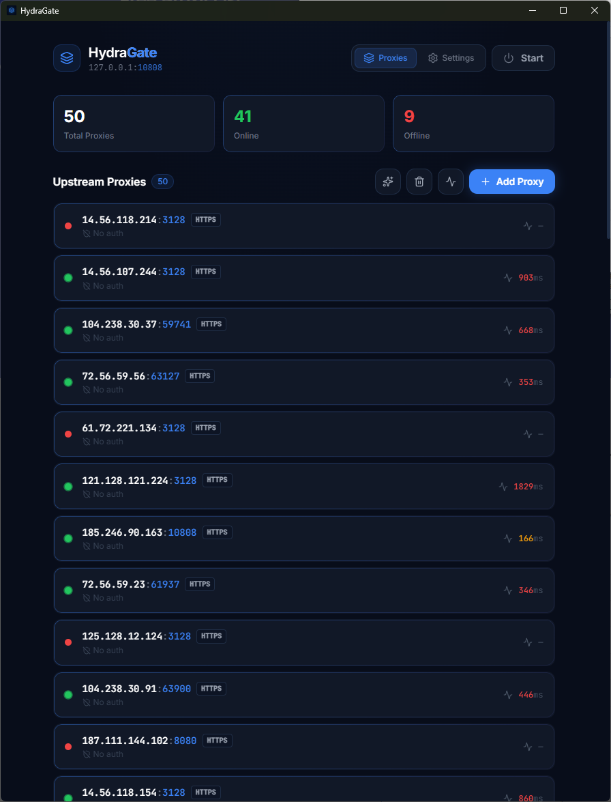
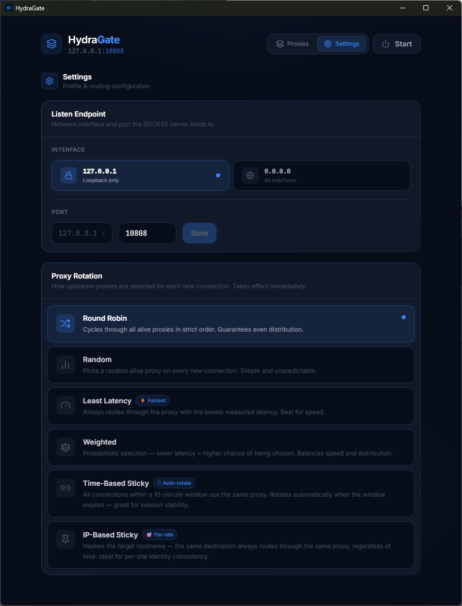

<p align="center">
  
</p>

<h1 align="center">HydraGate</h1>

<p align="center">
  <strong>One SOCKS5 endpoint. Infinite upstream proxies.</strong><br/>
  A lightweight, cross-platform desktop proxy aggregator built with Tauri + Rust + React.
</p>

<p align="center">
  
  
  
  
  
</p>

---

## 📸 Screenshots

| 🏠 Home — Proxy Dashboard | ⚙️ Settings — Rotation & Port |
|:---:|:---:|
|  |  |

---

**HydraGate** exposes a single local `SOCKS5` endpoint (`127.0.0.1:10808` by default) and intelligently routes every connection through a pool of upstream **SOCKS5 or HTTP/HTTPS** proxies. Add as many proxies as you like — HydraGate handles health checking, rotation, and failover automatically.

Think of it as a **proxy load-balancer** for your desktop and mobile devices.

---

## 💡 Use Cases

### 🤖 1. Headless Chrome / Playwright / Puppeteer — Bypassing Proxy Auth

The most common pain point HydraGate solves. Chromium-based browsers (Chrome, Puppeteer, Playwright, Selenium with Chrome) **do not support authenticated SOCKS5 proxies natively** — the `--proxy-server` flag accepts a proxy address but has no mechanism to pass credentials. Launching Chrome with an authenticated proxy simply results in a 407 error or a credentials popup that automation can't handle.

**HydraGate strips the auth layer** — your upstream proxies can have usernames and passwords, but your local endpoint is credential-free. Point Chrome at `127.0.0.1:10808` and it just works.

```bash
# Playwright / Puppeteer
chromium --proxy-server="socks5://127.0.0.1:10808" https://example.com

# Puppeteer (Node.js)
const browser = await puppeteer.launch({
  args: ['--proxy-server=socks5://127.0.0.1:10808']
});
```

```python
# Playwright (Python)
browser = playwright.chromium.launch(
    proxy={"server": "socks5://127.0.0.1:10808"}
)

# Selenium (Python)
options = webdriver.ChromeOptions()
options.add_argument('--proxy-server=socks5://127.0.0.1:10808')
driver = webdriver.Chrome(options=options)
```

---

### 🌐 2. Web Scraping at Scale — IP Rotation Without Code Changes

When scraping websites, getting blocked by rate limits or IP bans is the #1 problem. HydraGate lets you load a pool of proxies and automatically rotates IPs on every request — **without changing a single line of your scraper code**.

Just point your HTTP client at `127.0.0.1:10808`, and each connection transparently goes through a different upstream IP.

```python
import requests

proxies = {"https": "socks5://127.0.0.1:10808"}

# Every request may go through a different upstream IP automatically
for url in urls_to_scrape:
    response = requests.get(url, proxies=proxies)
```

> Use **Round Robin** mode for even distribution, or **Least Latency** for maximum scraping speed.

---

### 🔐 3. Apps / Tools That Don't Support Proxy Authentication

Many CLI tools, download managers, and legacy applications support SOCKS5 proxies but only without credentials. Examples include:

- `curl`, `wget`, `aria2c`
- Some torrent clients
- Database clients (DBeaver, TablePlus)
- API testing tools (Insomnia, older versions of Postman)
- Game launchers and update clients

HydraGate acts as an **auth bridge** — your tools connect to an unauthenticated local proxy, and HydraGate forwards through your password-protected upstream proxies.

```bash
# curl with no credential headaches
curl --socks5 127.0.0.1:10808 https://api.example.com

# wget
wget -e "use_proxy=yes" -e "socks_proxy=socks5://127.0.0.1:10808" https://example.com

# aria2c
aria2c --all-proxy="socks5://127.0.0.1:10808" https://example.com/file.zip
```

---

### 🛡️ 4. Privacy & Anonymity — Spread Your Footprint Across Multiple IPs

Instead of routing all your traffic through a single proxy (a single point of failure and a single fingerprint), HydraGate **spreads connections across multiple proxies simultaneously**. Different websites see different IPs, making it much harder to correlate your activity.

> Use **Random** or **Round Robin** mode for maximum IP diversity across sessions.

---

### 📌 5. Session-Sensitive Tasks — Sticky Proxy for Consistent Identity

Some workflows require that **all requests within a session appear to come from the same IP** — e.g., logging into a website, OAuth flows, shopping cart sessions, or any site that ties a session cookie to an IP.

HydraGate's **Time-Based Sticky** mode keeps the same proxy for a 10-minute window, then automatically rotates to the next one. This gives you stable per-session identity without manual management.

> Perfect for: account management bots, social media automation, e-commerce workflows.

---

### ⚡ 6. Load Testing — Avoid IP-Based Rate Limiting

When running load tests with tools like `k6`, `locust`, or `wrk`, all traffic originates from your single machine IP — which servers often detect and throttle. With HydraGate in front of your load tester, **each virtual user's connections spread across your proxy pool**, bypassing per-IP rate limits.

```python
# locust + SOCKS5
import socks, socket
socks.set_default_proxy(socks.SOCKS5, "127.0.0.1", 10808)
socket.socket = socks.socksocket
```

---

### 🏢 7. Multi-Account Management — Isolated IP per Account

Managing multiple accounts on platforms that track IPs? Use HydraGate's **Sticky** mode to ensure each account's session always uses the same proxy across a time window, or manage your proxy pool manually to pin specific proxies to specific accounts by controlling which proxies are active.

> Use cases: social media management agencies, e-commerce seller accounts, ad verification.

---

### 🔄 8. Proxy Pool Failover — Automatic Dead Proxy Bypass

If you run a fleet of proxies and some go down unpredictably, HydraGate's **automatic health checker** removes dead proxies from rotation every 30 seconds — **your application never even sees a failed connection due to a dead proxy**. No manual monitoring required.

> Ideal for: long-running bots, overnight scrape jobs, CI/CD pipelines that run browser tests.

---

### 🌍 9. Geo-Targeting — Route Traffic Through Specific Regions

If you have proxies in different countries, you can manage geographic routing by keeping only the relevant regional proxies active in your pool. Combined with **Least Latency** mode, HydraGate always routes through your fastest available geo-targeted proxy.

> Use cases: ad verification (checking how ads appear in different countries), geo-restricted content access, international price monitoring.

---

### 📊 Use Case → Recommended Rotation Mode

| Use Case | Best Mode |
|----------|-----------|
| Web scraping (max coverage) | 🔀 Round Robin |
| Web scraping (max speed) | ⚡ Least Latency |
| Session-based automation | 📌 Sticky |
| Privacy / fingerprint diversity | 🎲 Random |
| Load testing | ⚖️ Weighted |
| Headless browser automation | Any |
| Proxy failover / resilience | Any (auto-excludes dead proxies) |

---

## ✨ Features

### 🌐 Proxy Management
- **Add multiple upstream proxies** — Supports **SOCKS5** and **HTTP/HTTPS (CONNECT)**
- **Protocol prefixing** — Defaults to `socks5://` but supports `http://` and `https://`
- **Bulk import** — paste multiple proxies at once (`[protocol://]host:port[:user:pass]` format, one per line)
- **Live health status** — each proxy is shown as 🟢 Online or 🔴 Offline
- **Latency display** — real-time measured latency (ms) shown per proxy
- **Remove proxies** individually at any time

### 🔄 Automatic Health Checking
- Background health checks run **every 30 seconds** automatically
- Connects to a test endpoint (`1.1.1.1:53`) through each upstream proxy to verify it's alive
- Measures **round-trip latency** for every proxy on each check cycle
- Dead proxies are automatically excluded from routing

### ⚡ 6 Proxy Rotation Strategies
Switch between rotation modes at any time — changes apply **immediately** to new connections:

| Mode | Description |
|------|-------------|
| 🔀 **Round Robin** | Cycles through all alive proxies in strict order. Guarantees even distribution. |
| 🎲 **Random** | Picks a random alive proxy on every new connection. Simple and unpredictable. |
| ⚡ **Least Latency** | Always routes through the proxy with the lowest measured latency. Best for speed. |
| ⚖️ **Weighted** | Probabilistic selection — lower latency = higher chance of being chosen. Balances speed and distribution. |
| ⏱️ **Time-Based Sticky** | All connections within a 10-minute window use the same proxy. Auto-rotates when the window expires — great for session stability. |
| 🎯 **IP-Based Sticky** | Hashes the target hostname — the same destination always routes through the same proxy, regardless of time. Ideal for per-site identity consistency. |

### 🎛️ Server Control
- **One-click Start / Stop** of the local SOCKS5 listener
- Live **running indicator** with animated status badge
- **Configurable listen port** (default: `10808`, range: `1024–65535`)
- Port changes take effect on next server start

### 📊 Dashboard Stats
- **Total Proxies** count
- **Online** (alive) proxies counter
- **Offline** (dead) proxies counter
- Auto-refreshes every **5 seconds**

### 📱 Android Support

HydraGate is now available for Android! Take your proxy pool on the go.

- **Native Integration**: Built using Tauri's mobile capabilities.
- **Local SOCKS5 Server**: Runs a background service on your device, allowing other apps to route traffic through HydraGate.
- **Battery Optimized**: Efficient Rust backend ensures minimal battery drain during background proxying.
- **Unified Experience**: The same clean UI and rotation strategies as the desktop version.

---

## 🛠️ How to Use

### 1️⃣ Launch the App
Start HydraGate — the dashboard shows your proxy list and server status.

### 2️⃣ Add Your Proxies
Click the **"Add Proxy"** button and enter your proxies in one of these formats:

```
# Without authentication
host:port

# With authentication
host:port:username:password
```

You can paste **multiple proxies at once** — one per line. HydraGate imports them all in a single click.

**Example:**
```
192.168.1.100:1080
http://proxy.example.com:8080:user:pass
proxy.example.com:1080:myuser:mypassword
10.0.0.5:3128:admin:secret
```

### 3️⃣ Wait for Health Checks
Once added, proxies are health-checked automatically. After a few seconds you'll see each proxy marked as:
- 🟢 **Online** with a latency reading (e.g. `42 ms`)
- 🔴 **Offline** if the proxy is unreachable

### 4️⃣ Start the Server
Click the **"Start"** button in the top-right corner. The button turns green with a pulsing indicator when the server is running.

Your local SOCKS5 endpoint is now live at:
```
127.0.0.1:10808
```

### 5️⃣ Configure Your App / Browser
Point any application or browser to use the SOCKS5 proxy:

| Setting | Value |
|---------|-------|
| Proxy Type | `SOCKS5` |
| Host | `127.0.0.1` |
| Port | `10808` (or your configured port) |
| Auth | None required |

**Firefox example:** `Settings → Network Settings → Manual proxy → SOCKS Host: 127.0.0.1, Port: 10808`

**curl example:**
```bash
curl --socks5 127.0.0.1:10808 https://ifconfig.me
```

### 6️⃣ Choose Your Rotation Strategy
Navigate to the **Settings** tab (⚙️) and select your preferred rotation mode. The change is applied immediately to all new connections — no restart needed.

---

## ⚙️ Settings

### Listen Interface
Choose which network interface the SOCKS5 server binds to:

| Option | Bind Address | Access |
|--------|-------------|--------|
| 🔒 **Loopback** (default) | `127.0.0.1` | Only from this machine |
| 🌐 **All Interfaces** | `0.0.0.0` | From any device on the local network |

> ⚠️ **Warning:** Using `0.0.0.0` exposes HydraGate to all devices on your network. Only use this in trusted environments.

Changes take effect on next server start. The current bind address is always shown in the header.

### Listen Port
Configure which local port HydraGate binds to. Default is `10808`.

- Must be between `1024` and `65535`
- If the server is running, **stop and restart** it to apply the new port
- The current address is always shown in the header (`HOST:PORT`)

### Proxy Rotation Mode
See the [6 Proxy Rotation Strategies](#-6-proxy-rotation-strategies) section above. All modes operate exclusively over **alive proxies** — dead ones are always excluded.

---

## 📦 Proxy Format Reference

```
host:port
host:port:username:password
```

| Field | Required | Description |
|-------|----------|-------------|
| `host` | ✅ | IP address or domain name of the upstream proxy |
| `port` | ✅ | Port number of the upstream proxy |
| `username` | ❌ | Username for authenticated SOCKS5 proxies |
| `password` | ❌ | Password for authenticated SOCKS5 proxies |

---

## 🔒 Technical Details

- **Local endpoint**: Pure SOCKS5 (no-auth) listener on `127.0.0.1:<port>`
- **Upstream protocol**: SOCKS5 (with optional username/password auth)
- **Address types supported**: IPv4, IPv6, and domain names (SOCKS5 ATYP `0x01`, `0x03`, `0x04`)
- **Transport**: Full bidirectional TCP tunnel (`tokio::io::copy_bidirectional`)
- **Concurrency**: Each client connection is handled in its own async Tokio task
- **Health checks**: Every 30 seconds, all proxies are probed and latencies measured

---

## 🏗️ Tech Stack

| Layer | Technology |
|-------|-----------|
| Desktop/Mobile framework | [Tauri v2](https://tauri.app) |
| Backend | Rust + Tokio (async runtime) |
| Proxy clients | [`tokio-socks`](https://crates.io/crates/tokio-socks) + Native HTTP CONNECT |
| Frontend | React + TypeScript |
| UI components | [Lucide React](https://lucide.dev) |
| Build tool | Vite |
| Mobile Bridge | JNI (Android) |

---

## 🧑‍💻 Development

### Prerequisites
- [Rust](https://rustup.rs) (stable)
- [Node.js](https://nodejs.org) 18+
- [Tauri CLI](https://tauri.app/v1/guides/getting-started/prerequisites)

### Run in Development
```bash
npm install
npm run tauri dev
```

### Build for Production
```bash
npm run tauri build
```

The compiled installer will be in `src-tauri/target/release/bundle/`.

---

## 📄 License

MIT — built with ❤️ by [Samir Djelal](https://samirdjelal.com)
